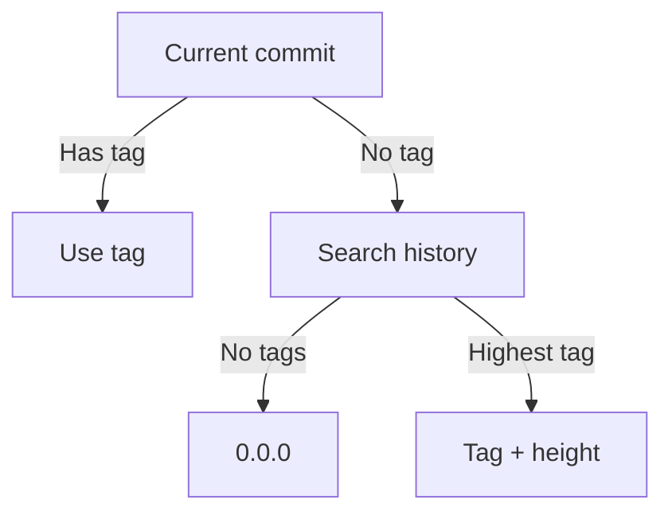

# Vergil

[](https://github.com/robertcoltheart/vergil/wiki) [](https://www.nuget.org/packages/Vergil) [](https://github.com/robertcoltheart/vergil/discussions) [](https://github.com/robertcoltheart/vergil/blob/master/LICENSE)

A thing that does something.

## Usage
Install the package from NuGet with `dotnet add package Vergil`.

```csharp
Example code
```

### Versioning Strategy
- If current commit has a version tag
  - Use the version as-is
- If current commit does not have a version tag
  - Search commit history for highest version tag
    - No tag found
      - Use 0.0.0 with height
    - Tag found
      - Use tag with height



### Configuration

```yaml
mode: Tagged # Tagged | Continuous
increment: Patch # Major | Minor | Patch | None
next-version: 0.0.0
match: (?<BranchName>.+)
label: ${BranchName}
tag-prefix: [vV]?
branches:
  main:
    match: ^master$|^main$
    label:
  release:
    match: ^releases?[\\/-]
    increment: Patch
    label:
    mode: Continuous
  feature:
    match: ^features?[\\/-](?<BranchName>.+)
    label: ${BranchName}
  pull-request:
    match: ^(pull-requests|pull|pr)[\\/-](?<Number>\\d*)
    label: PullRequest${Number}
```

#### Options
1. Choose which part of the version to increment if height needs to be added
2. Use a custom label for pre-release versions, or use the current branch name

## Documentation
See the [wiki](https://github.com/robertcoltheart/vergil/wiki) for examples and help using Vergil.

## Get in touch
Discuss with us on [Discussions](https://github.com/robertcoltheart/vergil/discussions), or raise an [issue](https://github.com/robertcoltheart/vergil/issues).

[](https://github.com/robertcoltheart/vergil/discussions)

## Contributing
Please read [CONTRIBUTING.md](CONTRIBUTING.md) for details on how to contribute to this project.
